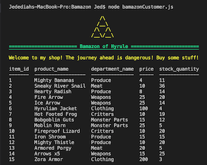

# Bamazon
Bamazon. 

Bamazon is a CLI storefront app. On load, the app displays a table of items for sale. It displays item ID, item name, item price (this one is Zelda themed, so the dollars have been converted to rupies), and the current inventory for each item. There is also a Triforce. 

It immediately prompts the user to enter the item ID of the item they want to purchase. After checking that the order does not exceed the current inventory, the app confirms the sale and updates the inventory accordingly. 

For the database, I used mySQL and mySQL Workbench. The schema:

