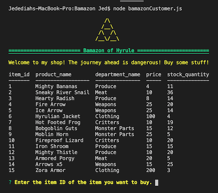
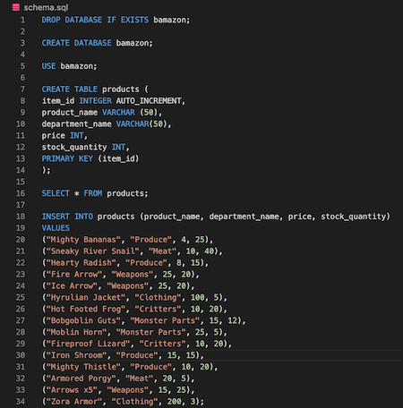
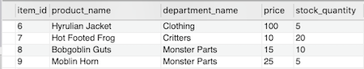

# Bamazon 

Bamazon is a CLI storefront app. On load, the app displays a table of items for sale. It displays item ID, item name, item price (this one is Zelda themed, so the dollars have been converted to rupies), and the current inventory for each item. There is also a Triforce. 

It immediately prompts the user to enter the item ID of the item they want to purchase. After checking that the order is in stock, the app confirms the sale and updates the inventory accordingly. 

## Technologies Used

Node.js, Javascript, mySQL, my SQL Workbench, Node Modules (inquirer, console.table, colors)

## How It Works

For the database, I used mySQL and mySQL Workbench. The schema:

The `purchase()` function uses inquirer to prompt the user to complete the transaction. Then, the `checkInv()` function queries the database to make sure the requested quantity doesn not exceed the stock quantity. If it does, the app displays a message saying as much and calls the `purchase()` function again. In the screen shot below, the user chose to purchase two "Bobgoblin Guts."     

The `transact()` function updates the database. As shown below, the stock quantity of "Bobgoblin Guts" has decreased from 10 to 8.

